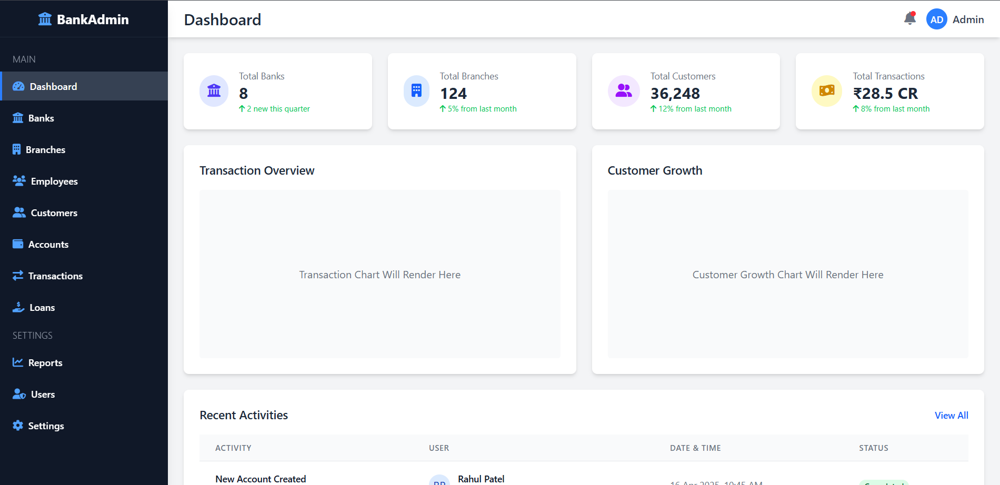

# 🏦 BankAdmin Dashboard (DBMS Project)

A responsive and modern Bank Administration Dashboard created as a DBMS project. This web app simulates a centralized admin panel for managing core banking data such as Banks, Branches, Employees, Customers, Accounts, Transactions, and Loans.

---

## 📸 Preview



---

## 📁 Project Structure

```
DBMS-PROJECT/
├── dist/
│   ├── Accounts.html
│   ├── Banks.html
│   ├── Branches.html
│   ├── Customers.html
│   ├── Employees.html
│   ├── index.html
│   ├── Loans.html
│   ├── Transactions.html
│   └── style.css
├── src/
│   └── input.css
├── node_modules/
├── package.json
├── package-lock.json
└── tailwind.config.js
```

---

## 🛠️ Tech Stack

- **HTML5**
- **CSS3**
- **Tailwind CSS**
- **JavaScript (vanilla)**

---

## ✨ Features

- ✅ Dashboard with live metrics
- ✅ Side navigation for all banking modules
- ✅ Responsive design
- ✅ Clean and modern UI
- ✅ Tailwind-based component styling
- ✅ Placeholder for chart integration

---


## 📌 Notes

- This is a **frontend-only** project.
- Charts section is just a placeholder – you can use libraries like `Chart.js` or `ApexCharts` to add visualizations.
- Can be extended with backend using Node.js, Flask, or Django.

---

## 👨‍💻 Author

**Siddhesh**  
🎓 B.Tech CSE (AI&ML), SRM University  
💡 Passionate about AI, ML, and Full-Stack Development  
📬 Reach out on [LinkedIn](https://www.linkedin.com) or [Twitter](https://twitter.com)

---

## 📃 License

This project is licensed under the [MIT License](LICENSE).
